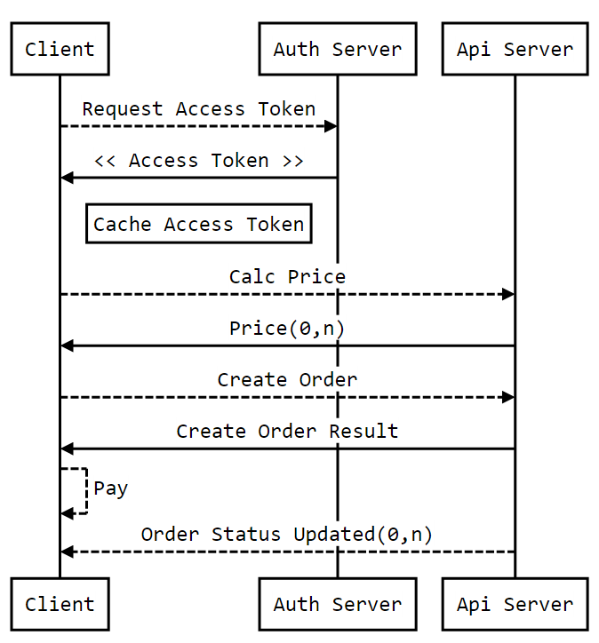

## 流程说明

### 流程图

### 步骤

1. [获取access_token](<客户端认证和授权/获取access_token.md>)
2. [询价](<02.询价.md>)
3. [下单](03.下单.md)
4. [通过外部订单号获取订单数据](<04.通过外部订单号获取订单数据.md>)

### 其它说明 

1. 验签

如果POST请求有验签要求，则在上行操作的时候带上sign参数，生成方式是将[post body]+[client secret]进行md5加密
例如：https://bit-s.cc/platform/api/public/v4/query_order_by_out_order_no?sign=3595ce62ef2d98399a0d90cbe589e204

GET请求验签:例如订单状态回调接口中，在url中会带一个sign参数=把所有URL参数（不含sign）按字典序排列生成key=value的字符串，再加上client_secret，进行md5

2. 状态通知
如果订单状态发生了改变，则通过statusNotifyUrl通知接入方，调用该url时，会将接入方原有参数附加订单号，订单新状态一并带入，如果已生成保单，会附带保单号保单起止日期。
该通知在失败的情况下，共会发起相隔5分钟的10次请求尝试。

## links
   * 上一节: [服务器地址](<00.服务器地址.md>)
   * 下一节: [询价](<02.询价.md>)

